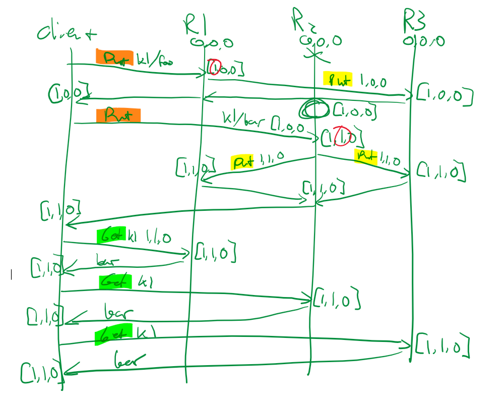
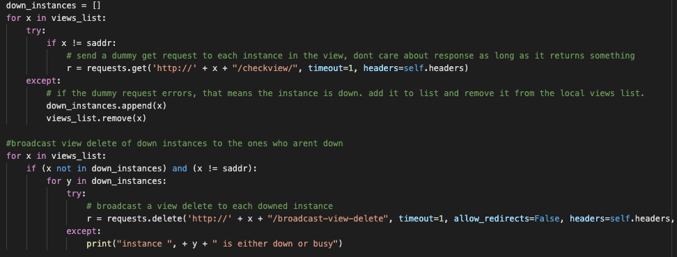
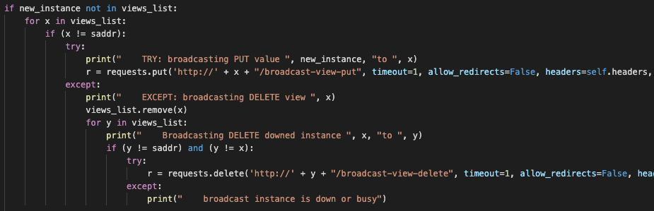

# Mechanism Description
the description of the mechanisms implemented for causal dependency tracking and detecting that a replica is down

* `Assignment 3`
* `Garrett Webb`
* `Kai Hsieh`
* `Rahul Arora`

## Causal Consistency Mechanism
* We made the graph below as a guide for how to implement the causal consistency portion of this project.
* 
* We pass vector clocks between the client and replicas. Vector clocks are stored as python dictionaries (hash tables)
with the keys being the replica server addresses, and the values being the corresponding vector clock values for each 
replica. Since vector clocks are passed back from replicas to clients, who then send them back to other replicas in new 
requests, if a replica determines that their vector clock is not updated, which is likely because the replica instance
was disconnected from the others, it will GET request all other replicas for their updated key-value store values and updated
vector clock(s). Additionally, vector clock values are only incremented by the replicas (by 1) when a replica receives a 
PUT or DELETE request from a client. At this point, the replica will broadcast the request to other replicas with the 
updated vector clock as casual metadata, causing them to update their vector clocks to match the one sent in the broadcast.

## View Operations Mechanism
* Using the logic below, we were able to get a list of downed instances upon a view-get and broadcast the view-delete operation for all downed instances to all instances that are still up.
*  
* On view get, we send a dummy get request to each view that we have a record of being running. If we do not receive a response before the request times out, we can safely assume that the replica is down. 
* The logic to detect and broadcast view-delete from within other server functionality is also largely reused and looks like this. in this example from the PUT functionality, the server will broadcast to the terminal key put endpoint, which will not further forward the request. If one of those broadcasts fails, that means the server being broadcasted to is down and we will then broadcast a view delete to all other replicas in the view list.
* 
* The thought process behind this was that if on any broadcasted request, there is no response from the broadcastee, that means that the instance is either down or disconnected and must be removed from the views list, which is shared by all the instances. This is why the view-delete operation is then broadcasted.
* One false positive that could happen in this model is the case of one of the broadcastee instances being slow to respond. This could happen for many reasons, including the case that the instance is broadcasting and waiting for responses itself. In this case, the instance would not be able to respond before the timeout of 1 second that we specified. The timeout is low because with all of these instances being run on the same system through docker, a successful connection should never take that long.
* One false negative that could happen in this model is the case of one of the broadcastee instances responds and then fails post-request. The request to check if the replica was alive would have succeeded, but the replica would have died immediately after.